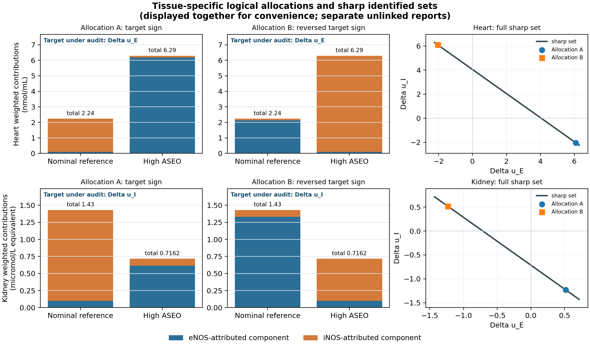

# Bulk tissue nitrite source identifiability

This reproducibility package shows that the same published bulk-tissue nitrite values can be generated by opposite eNOS/iNOS source changes. The observations are compatible with the proposed biology, but bulk nitrite alone cannot identify which NOS source changed.

[Read the manuscript](manuscript/rendered/Bulk_Tissue_Nitrite_Source_Contributions_2026.pdf) · [Inspect source provenance](sources/PROVENANCE_AUDIT.md) · [View the verification certificate](evidence/verification_summary.json)

## Main finding

The primary descriptive comparison uses the reported lead-plus-olive-oil group as a **nominal reference** for the high-dose *Allium sativum* essential-oil group. Causal matching is not assumed.

| Tissue | Observed bulk contrast | Sharp interval for either source component |
|---|---:|---:|
| Heart | +4.05 nmol/mL | [-2.24, 6.29] |
| Kidney | -0.7138 µmol/L | [-1.43, 0.7162] |

Both intervals contain positive and negative values. Explicit, strictly positive source allocations reproduce the published totals while reversing the proposed source-level signs.



The heart and kidney values come from separate reports with no public animal-level linkage. This repository contains no new animal observations and does not claim that the treatment groups are causally matched. The lead-alone comparison is retained as a secondary descriptive analysis.

## Reproduce the analysis

The recorded test environment is CPython 3.14.3 on Windows.

```powershell
py -3.14 -m venv .venv
.\.venv\Scripts\Activate.ps1
python -m pip install -r requirements-lock.txt
powershell -ExecutionPolicy Bypass -File .\reproduce.ps1
```

The final command regenerates the computational evidence and runs the numerical tests. The analysis is deterministic: it uses no network access, random numbers, imputation, simulated outcomes, or reconstructed animal-level data.

For a shorter dependency list, install `requirements.txt`. `requirements-lock.txt` records the exact direct and transitive packages used for verification.

## Generated outputs

- `evidence/verification_summary.json` — machine-readable contrasts, sharp bounds, witness checks, and matrix-rank certificates
- `evidence/prospective_power_grid.csv` — prospective two-sample power sensitivity grid
- `evidence/published_bulk_directions.{png,pdf}` — published aggregate directions
- `evidence/source_partition_witnesses.{png,pdf}` — exact source-reversal witnesses

The rendered manuscript is at [`manuscript/rendered/Bulk_Tissue_Nitrite_Source_Contributions_2026.pdf`](manuscript/rendered/Bulk_Tissue_Nitrite_Source_Contributions_2026.pdf). Rebuilding it additionally requires `pdflatex` and `bibtex`:

```powershell
powershell -ExecutionPolicy Bypass -File .\manuscript\source\build.ps1
```

## Repository map

| Path | Contents |
|---|---|
| `code/` | Deterministic analysis |
| `tests/` | Numerical and reconstruction checks |
| `data/` | Published aggregate transcriptions and provenance fields |
| `evidence/` | Generated certificates, figures, and the unexecuted confirmatory protocol |
| `sources/` | Source index, field-level provenance audit, and search record |
| `manuscript/` | LaTeX source and rendered paper |

## Sources and redistribution

The data files are manual transcriptions of published group-level values. They contain no individual-animal records or reconstructed raw data. Citations, DOI/PMCID identifiers, source locations, and retrieval provenance are preserved in [`sources/SOURCE_INDEX.md`](sources/SOURCE_INDEX.md), [`sources/PROVENANCE_AUDIT.md`](sources/PROVENANCE_AUDIT.md), and the data tables.

Third-party publisher PDFs are intentionally not redistributed. Retrieve the cited articles through their DOI or public archive and follow the applicable license terms.
